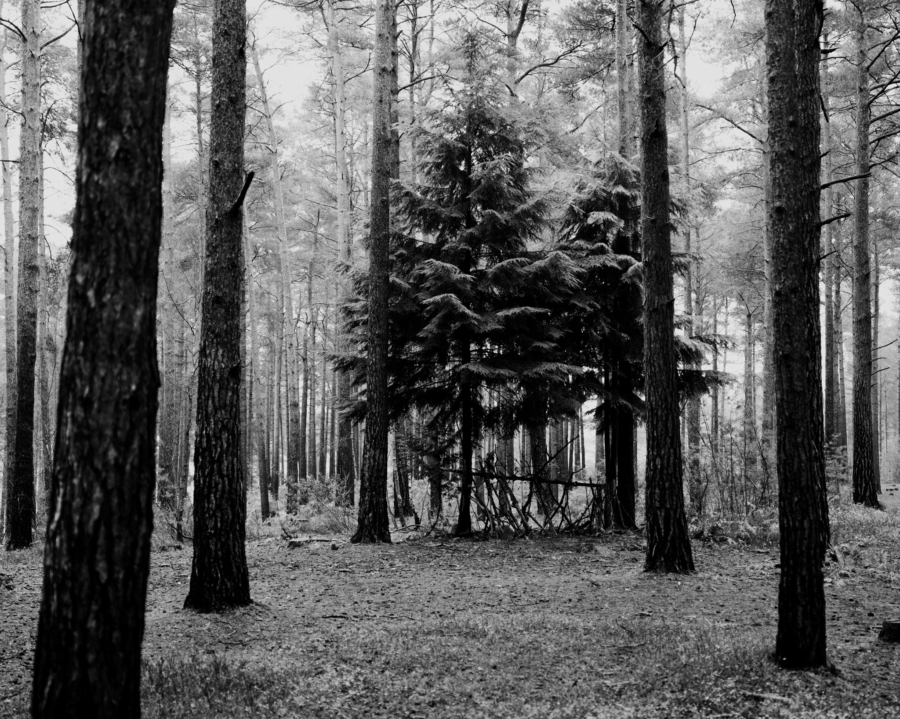

Bit of a warning, this gets quite personal and talks about Autism.

I’ve been trying to write this post for about a week already, going back and forth in my head of should I, shouldn’t I. These last few weeks I’ve been struggling with parts of my identity and how I present myself to others.

Since finding out I’m Autistic half way through 2022, I’ve been thinking a lot about unmasking and what that would mean for me, and those close to me. I’ve had to be a lot more social the last few weeks due to the holidays and seeing more people in person. That’s been quite exhausting for me because I’ve had to mask a lot more than if I was just doing my own thing. It got me questioning how much of this has carried on to my online life too.

I spend an awful amount of time online, and presenting myself to people who don’t really know me. I hadn’t considered before that I’m also masking while I’m online. The way I talk, the phrases I use, the tone of voice. This is why I cringe a little when I read back tweets and posts from even a few months ago. I’ve started this journey of unmasking and finding my authentic voice again. Sometimes there’s some alignment, but it’s rare. Up until now I’ve been altering the way I talk to try and fit in, whether consciously or not.

It’s draining.

I’ve also found it hard to get away from the idea of pursuing art full-time. It’s something I’d love to be able to do. I love making new work, building out ways of sharing and selling said work. It scratches an itch that’s always present for me. However I feel like my authentic voice is fighting against the one that’s needed to successfully market myself as an artist. This is even more obvious in the space I’m most often operating in, crypto and NFTs in particular.

If I’m being authentic, I’m a loner. I produce all my work myself, the websites, the smart contracts, everything. It’s how I prefer to work. This contradicts the feeling of open collaboration and sharing in the crypto space. I don’t say "gm" or "wagmi". I can appreciate the sentiment, but I feel like my authentic self doesn’t fit in. It almost feels like if I want to be a full-time artist in this space, then I have to become an influencer to pay my bills. I’m not saying there are no authentic artists, and it’s not a dig at anyone. It’s just my feeling that the artists with successful projects spend the majority of their time on Twitter cultivating this sense of community. Being Autistic makes that really hard for me. I’m quiet and awkward. I suck at selling myself. It feels clunky. I can try but it’s all a mask, and it’s the one thing that saps my energy the most.

I’m also scared if I try to do that in a way that feels authentic to me, people won’t like it, or I’ll just be ignored when I just want to be seen for who I am and the work I make. I’m left questioning if it’s even possible for me.

There’s lots of factors going on here, and I’m probably conflating a lot of feelings. I’ve just been feeling uneasy in my own skin, and reconciling all the emotions has been really hard on me mentally. There’s definitely a sign that I need to spend less time online and making comparisons, but it’s also how I’m currently making a portion of my income so I can’t go cold turkey. It makes me want to run away to Scotland again. I feel so at peace when I’m there. Realistically I probably just need a therapist that specialises in working with adults who find out they’re Autistic later on in life to help with the reconciliation.

I’m currently reading [Unmasking Autism](https://www.amazon.co.uk/Unmasking-Autism-Incredible-Hidden-Neurodiversity/dp/1800960549) by Dr. Devon Price. It’s reassuring knowing I’m not the only one experiencing the things I’m going through (obviously), but it’s also bringing up a lot of feelings I’ve been repressing. Feelings of alienation and loneliness. People thinking I’m a little odd and avoiding me. How exhausting it is trying to fit in. How I’ve got by so far in my life by just being good at something as a service to others. Being valued for my output and not necessarily me as a human being. So much of the book has resonated with me already, I wanted to share a couple of paragraphs.

> In media, nearly every Autistic character is a white man with a monotone voice, rude demeanor, and a penchant for science. \[…\] In this cultural landscape, there’s little room for Autistics who are sensitive, emotionally expressive, artistic, or uninterested in academic success. Autism is so broadly associated with assholery that many of us initially hate associating with the term, and try to overcompensate by being excessively easygoing and nonconfrontational. It takes many years of research and meeting real-life counter-examples for most of us to recognize Autism isn’t the cold, robotic condition we’ve been told it is.
>
> \[…\]
>
> Masked Autistic people are basically everywhere, though by our very nature we’re socially invisible. You can find us in any number of fields people might not associate with stereotypically Autistic behavior, including sales, the service industry, and the arts. Because so many of us mask through inhibition and withdrawal, we might not stand out as socially awkward, at least not in a way anyone can pinpoint. Though many of us experience sensory issues, anxiety, meltdowns, and debilitating mental health symptoms, we push as much of that misery into the private realm as possible. Our elaborate veils of coping mechanisms and camouflaging can create the illusion we don’t need help. Often this comes at the expense of giving up on the areas of life where we might need assistance. We may eschew relationships, drop out of grueling academic programs, avoid working in fields that require networking and socializing, or completely disengage from activities that involve using our bodies, because we feel so detached and uncoordinated in them. Most of us are haunted by the sense there’s something "wrong" or "missing" in our lives- that we’re sacrificing far more of ourselves than other people in order to get by and receiving far less in return.

I really recommend reading the book, even if you’re not Autistic. It breaks down the awful stereotypes and humanises the disability in a way I can’t even begin to here.

It’s inspired me to make more work around this topic, and maybe that’s how I can get past this feeling. I should make something that expresses it. It makes me so happy seeing people excited about my work, or when they get a print and have a physical thing of something I’ve made. It gives me hope that things will be ok, and if I just persevere as my authentic self, I’ll get where I want to be eventually.

Here’s to being more Authentistic.

Before I go, I’d love to meet more Autistic people in the arts. If you’re in a community already, or you’re an Autistic artist yourself, please come talk to me! You can email me on sam@samking.studio or [@samkingco](https://twitter.com/samkingco) on Twitter.

Thanks for reading, Sam.
