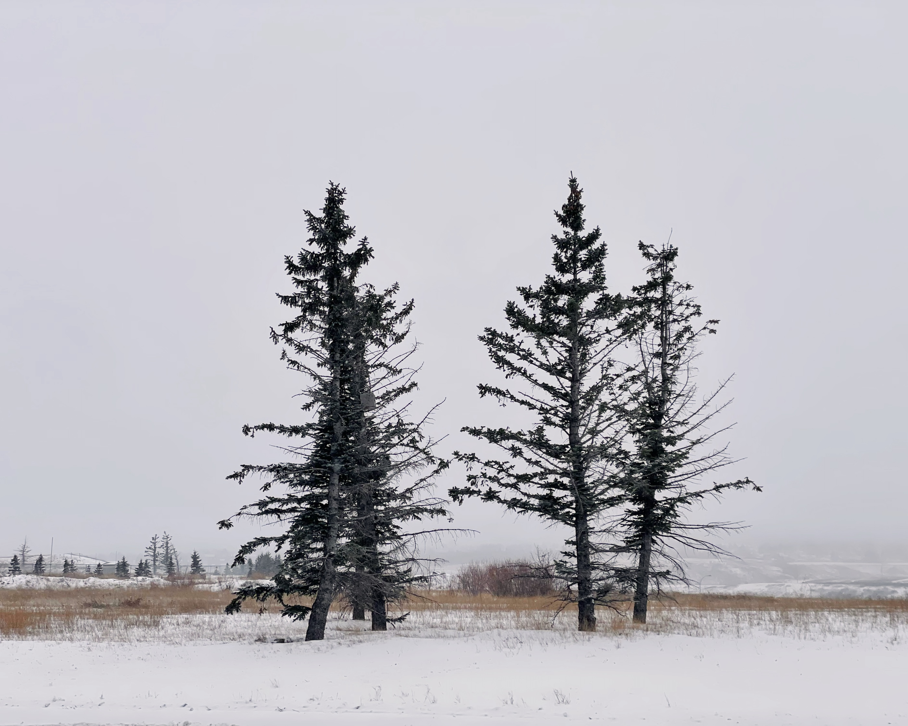
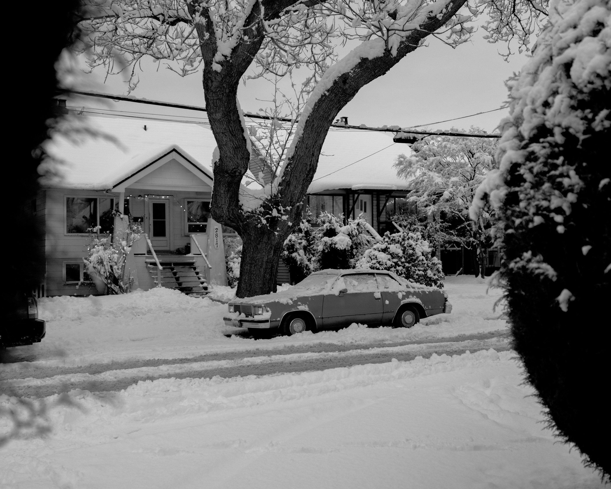

My writing cadence is more sporadic than I hoped. I thought having a proper space for these journal entries would make me write more, but maybe I just don't have much to say all the time. I've moved all my entries from [samking.blog](https://samking.blog) into this site. I was a bit hesitant initially since this is my "professional" space, and my journal entries so far have been pretty personal and sometimes intense, but fuck it.

The last entry from six months ago was about my state of mind at the time. I wasn't in a great place. My mind was scattered, and some pretty bad things were swirling. I felt hopeless. I'm doing better now. I still have my days of course, but I feel good.

## So what changed?

Annesah and I went to a Mac DeMarco gig in Hackney, right over the road from where I used to live. I hadn't been back there since the end of 2019 and it felt strange. Nostalgic for the last time I was there, panicking about a move back to my hometown. It made me realise how all over the place I was back then too. I was in a stressful job, big noisy city, I'd just come out of a relationship, and my Mum was going through some health stuff. Moving to my hometown was a chance to spend more time with family, but as soon as I got there, lockdowns happened. I was alone in my flat, working flat out at a new job in the healthcare space. It felt chaotic and I was burning out hard.

We sat in the Dress Circle watching Mac and his band, and I suddenly felt overwhelmed with emotions. Not necessarily from the music, but from things catching up to me. Walking from the station to the venue with all the memories of my old routine, how I felt back then, what I was going through. In between songs, Mac would talk about his hometown of Edmonton, Canada. The slower pace of life, the mountains of Alberta. I remembered I'd always wanted to visit but never did. I felt this pull in my chest, like I was meant to be somewhere else, somewhere like Canada. It sounds cheesy, but it was like I didn't belong in the UK anymore.

On the train back home in the morning, we were casually talking about Canada and what it would be like to live there. Annesah checked what the visa process was like, and it seemed like something we could do. It was late August and the contract on our house was up in December. We'd only have a few months to apply and get accepted into the pool, so we had to decide quickly. Do we stay in the UK, renew the house contract and find more work, or do we go all in on Canada.

I'm very impulsive, but not good at dealing with big changes. Annesah is someone who has to really think about a decision, especially one like moving 4,500 miles across the world. For some reason, it wasn't really a decision either of us gave much thought. We sort of just decided on impulse. Moving to Vancouver just felt right.

## Valley of despair

We began selling and donating most of our furniture and belongings, and then put the rest in storage. I loathe moving. I find it so hard. The last two times I've moved, I was on my own and it was hell. At least I could just chuck everything in boxes and be done with it. This time, I had to sift through and decide what I was doing with my things. I found it so hard. It took up so much space in my head, I could feel I was getting overwhelmed.

The thought of "wtf are we doing?!" crossed my mind a lot. I hated it.

Luckily, my Mum was kind enough to let us stay with her for the period between moving out and actually moving to Canada. It was over Christmas, so I got to spend more time with her again, along with my brothers, their partners, and my niece. I just tried to enjoy that last month, and get some rest.

## Hello Canada

The flight here was horrendous. It started with a 2 hour delay at Heathrow which made us miss the connection from Calgary to Vancouver. That turned into a 30 hour delay overall. The weather really fucked us.

We've been in Vancouver for a couple of days now though. It's been hard to get out because there was a huge dumping of snow, but it's also kind of nice because I haven't seen snow like this in years. We had to leave our hiking boots in the UK due to lack of space in our cases, but we both picked up some new ones today. I'm looking forward to getting out more now I have some weather appropriate footwear.

I'm obviously a bit homesick and jet lagged, but so far I like it. I have no idea how I'll feel about it in six months, or two years. Whether I'll apply for permanent residency, head back to the UK, or somewhere else entirely. I just need to try something different, see the mountains, and take it day by day.

I'm still working on [Refrakt](https://refrakt.app), but I'll need to start looking for a more permanent job soon, even if it's part-time. Staying in AirBnb's is okay for now, however we definitely need our own place. A job is kind of necessary for that. If you know of any companies here that are hiring designers or engineers, I'd love an intro.

But yeah, I like it. I'm hopeful for the life I could build here, and I'm feeling good.

Thanks for reading. 
Sam
