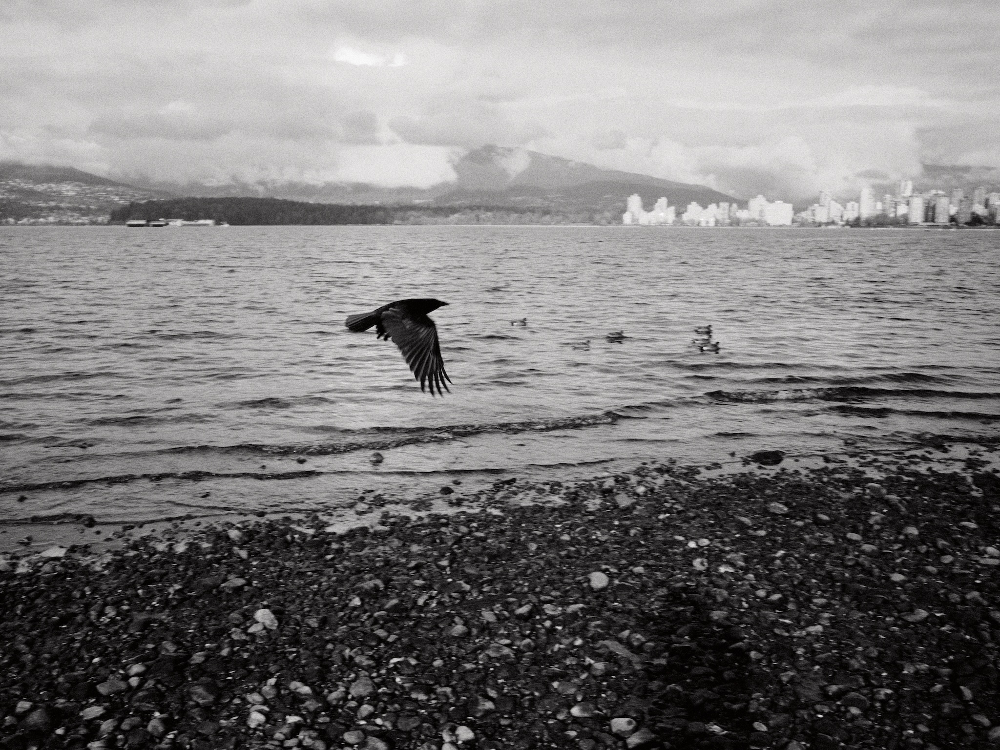
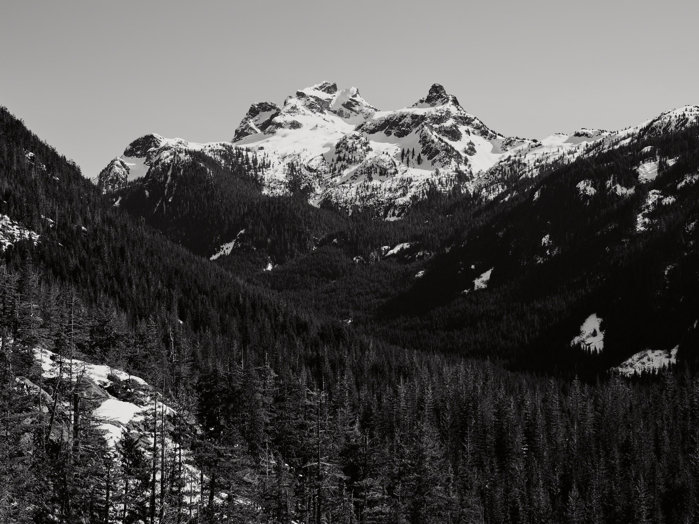

This isn't about how to be productive, but rather sitting with the uncomfortable reality that my relationship with productivity has shifted, and I'm not sure what that means yet.

It's been fifteen months since I arrived in Vancouver in the chill of winter. Those first months I worked on Refrakt, picked up freelance projects, tried to find my footing in a new city with new customs. I told myself I was taking it easy, setting my own pace. But there was always this underlying pressure, this voice asking: shouldn't you be doing more?

I used to be able to do more. In my early twenties, I was unstoppable. One-hour train ride into London? Perfect for coding. Work 10am-7pm at a startup, train home coding, break for dinner, then work until 3am on some animation detail nobody would notice. Up at 7 to do it again. My body could take it. My brain craved it.

Now, at thirty-something, my brain still wants those marathons but my body stages a quiet rebellion. The spirit is willing but the flesh is exhausted. And the guilt is suffocating.

In May of 2024, I joined a small startup. Structure, I thought. Routine. The team was welcoming, the work engaging. We flew to LA, pulled long days before launches, built things that were fun. Classic startup energy, intoxicating until it isn't.

Then October came, and my Nan passed. Being 4,500 miles away while my family grieved felt like watching life through frosted glass. The funeral trip was strange—a brief return to a life that no longer felt like mine. When I came back to Vancouver, back to the startup grind, something had shifted. The job felt too heavy to carry. By December, the exhaustion was bone-deep and I quit.

These past few months have been different. Back to freelance with some old friends who've been incredibly supportive (you know who you are). The plan was simple: work less, hike more, maybe build something new on my "off" days. But guilt has a way of creeping in. Every day I choose the trails over the laptop is money left on the table—rent money, credit card payments, future travel funds. I could force myself to work those days off, bill those hours, stack that cash. But something in me needs those mountains more than the money.

There's this thing about being autistic that I don't talk about much. Not because I'm ashamed, but because the world isn't always kind to difference, and visa applications don't have a checkbox for "functions differently but contributes meaningfully". It makes the traditional work environment feel like wearing a suit two sizes too small. Collaborative work can be energizing, but it drains me in ways I'm only now understanding. I'll lose ten hours to hyperfocus, forget to eat, then wonder why I'm shattered for days afterward.

So I started building [akkeri](https://akkeri.app) on weekends. It was originally Refrakt V2, now its own thing. It's everything I wanted Refrakt to become: spaces for actual conversation, collaboration without performance, a place to plan trips with friends to go shoot together. No migration anxiety, no burden of existing users' expectations. Just building for the joy of building.

My photography has shifted too. SD cards pile up like film rolls, waiting for their moment. There's something honest about delayed gratification in our instant world. The images exist, captured, patient. They'll be there when I'm ready. Same with YouTube where I'll film things that may never see an edit. The channel sits dormant, not abandoned, just resting. Maybe video is something that comes and goes throughout my life, like everything else. I'm consistently inconsistent, and I'm learning that's okay.

The other day, I threw my first pot in two years. Just a two-hour workshop, nothing fancy. My hands remembered the clay even if my mind had forgotten. It came out pretty good but rough around the edges. But it existed. I had made something with my hands that nobody could automate, no AI could replicate. There's a productivity in that, in being present with materials that push back.

I'm prepping to leave Vancouver at the end of May and head east across Canada. Start on the island up north, hit the towns between here and the Rockies, maybe Calgary, then further east. There's this tension, the impulse to film and photograph every moment is at odds with the desire to just exist in these places without the pressure of output.

All this talk of productivity feels especially absurd when I think about what happens when AI inevitably takes over our jobs, and outputs are redefined. Photographers, designers, developers, we're all on borrowed time, but maybe that's freedom in disguise. Maybe we get to return to making things because we must, not because they're billable. Maybe I'll make wonky pots and sell them to the three people who appreciate the imperfections. Or maybe the AI overlords will lead to the ceasing of our existence. Who knows.

Vancouver taught me that being productive doesn't mean what I thought it did. I came here burnt out, thinking I needed to maintain that twenties energy just at my own pace. But productivity isn't about output, it's about alignment. Some days that's code. Some days it's a six-hour hike where the only thing I produce is sweat, an insatiable appetite, and a clearer head.

The productivity guilt is still there, probably always will be. But I'm learning to live alongside it rather than under it. Learning that productivity can mean being outside and using my senses. My brain may not be built for this world's version of productivity. That's okay. I'm building my own.

