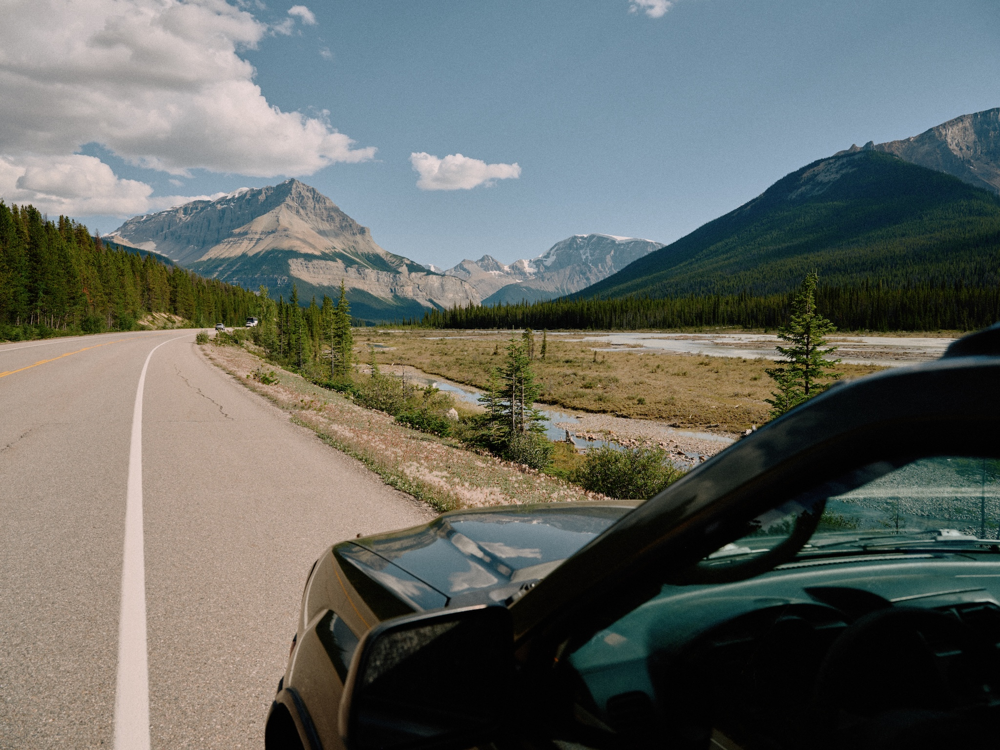
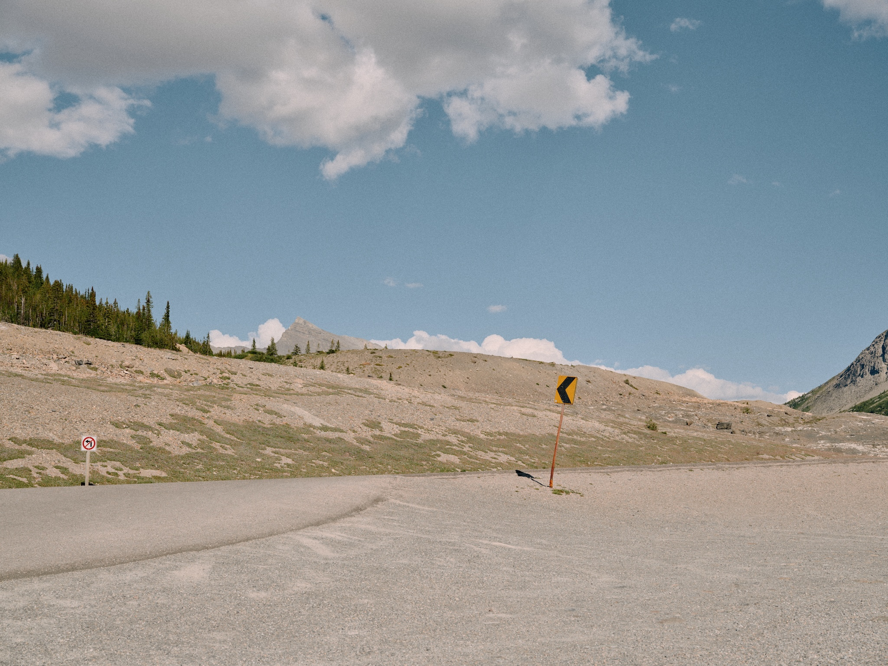
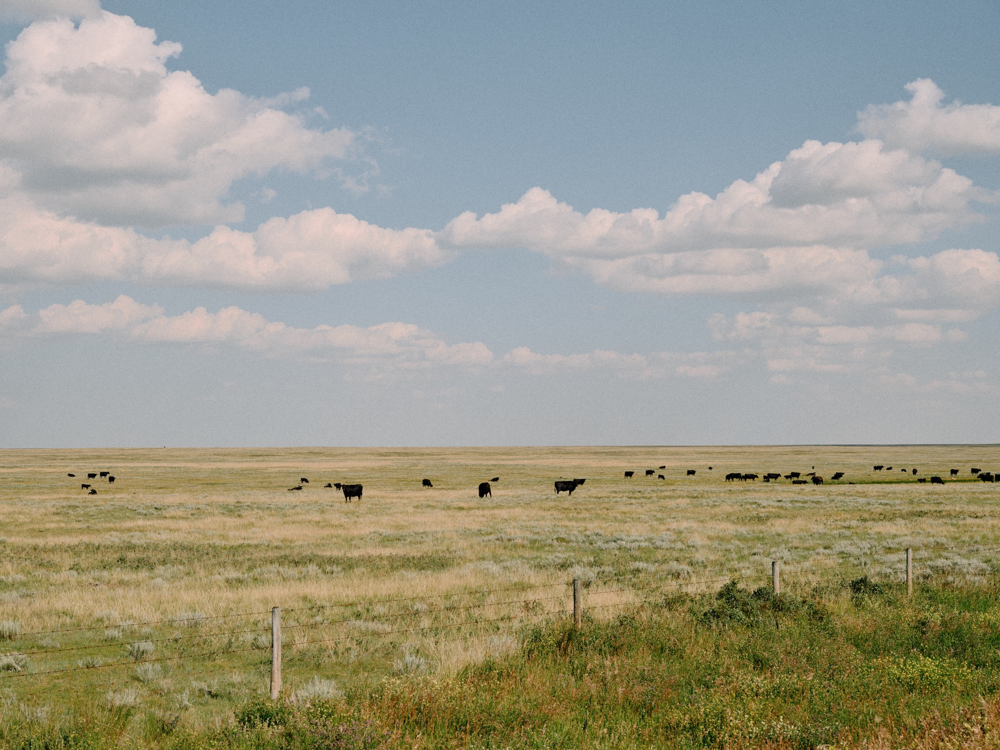

Back in April, [I wrote about productivity and guilt](/journal/on-being-productive-today), about choosing mountains over money. I thought I was still processing personal burnout. Two months of travelling later, I realize I was only scratching the surface.

This week I made the mistake of opening LinkedIn. Success story after success story, funding rounds, AI launches, exponential growth. Meanwhile I'm sitting in my car, surrounded by everything I own, wondering what the fuck I'm doing with my life. The disconnect between their world and mine feels insurmountable.

Here's the thing though: I'm literally freelancing for an AI startup right now. The irony isn't lost on me. They're good people, genuinely supportive, building something that brings joy to creators. I can see the value in what they're doing. But I also can't unsee the bigger picture. My LinkedIn feed full of layoff stories followed immediately by "We're excited to announce our new AI initiative!".

They're accelerating toward a cliff and calling it progress. The world feels like it's crumbling at an insane pace, and I'm not sure of my place in it anymore…

Driving through Alberta yesterday, I passed a truck full of cows. You could see their eyes through the slats, these beautiful creatures hours from slaughter, and everyone just… drove past like it was nothing. I've been vegetarian for nearly a decade, and sometimes I still can't comprehend how disconnected we've become. If that truck was full of dogs, people would lose their minds. But cows, just as intelligent, just as capable of suffering… that's just business.

The UK, my home that doesn't feel like home anymore, slides further into an authoritarian surveillance state. The new Online Safety Act requires age verification for any platform where users might interact, meaning you have to upload your ID to some dodgy third party just to access a subreddit. They claim it's protecting children, but it's censorship wearing a safety mask. Facial recognition for shoplifters. ANPR tracking every journey. CCTV on every corner. They're one step away from prosecuting thoughtcrime, and everyone's too tired to resist. If I write about Palestinian freedom from Canada, I have to know that could mean jail time back home soon. That's not paranoia, that's the trajectory we're on.

Even escaping to nature doesn't help. The national parks here are spectacular, but they're being loved to death. I visit the same popular spots, so I'm aware I'm part of the problem, like complaining about traffic while being in the jam. But watching people walk off marked trails, leave trash, blast music from speakers, it's like there's this complete inability to just exist in a space without consuming it. It can't have always been like this, surely?

I also don't know where my money will come from in the future. I see friends back home struggling with the cost of living crisis, wages that haven't moved in years while everything else doubles in price. We're all trying to survive in a system that demands growth or death. Even if I had the business acumen to profit from this mess, building tools to replace workers, optimizing surveillance… my morals won't let me. I can't bring myself to accelerate the very problems that keep me up at night.

The thing about building [akkeri](https://akkeri.app) is that it represents this tension perfectly. I want to build tools for smaller, more intentional communities. Maybe that's the answer, small apps for small communities, like choosing a small town over a sprawling country. I'd do everything to keep it from becoming another engagement-optimized hellscape. But even that feels naive when the entire internet is being enshittified. Every refuge becomes a resort.

With Refrakt, I naively thought "build something simple and people will connect". But it still feels like shouting into a void. The legal requirements don't help. Constantly changing rules, different demands from each country, all designed for companies with compliance teams while tech giants do whatever they want. It's not the platform I set out to build.

April me thought productivity guilt was the problem. August me realizes that was just the symptom. The real issue is that we've built a world where being productive means accelerating our own obsolescence, where success is measured in how efficiently you can exploit others, where mental health is a luxury and basic humanity is a liability.

But here's where it gets complicated. Despite everything, I still have hope. I see it in friends trying to build ethical AI, in communities forming around mutual aid, in people choosing repair over replacement. It's just that my faith erodes with every new headline, every regulation that misses the point, every system that prioritizes profit over people.

I'm still working, just less. Travel has given me perspective but also made everything feel more precarious. When this trip ends, I'll need a roof over my head like everyone else. I don't have much of a buffer to retrain for whatever jobs AI hasn't eaten yet. The next big model drop could wipe out my current livelihood overnight.

What I really want is to live simply. Take photos. Make things for people who appreciate them. Find a corner of the world where I can exist without contributing to the machinery. The woods keep calling, not because they're pure or romantic, but because when every system is broken, opting out starts to look like resistance.

I just have this growing certainty that we can't continue on this path. So I'll keep moving. Keep building small things for small groups of people who still give a shit, when I can find the energy.
